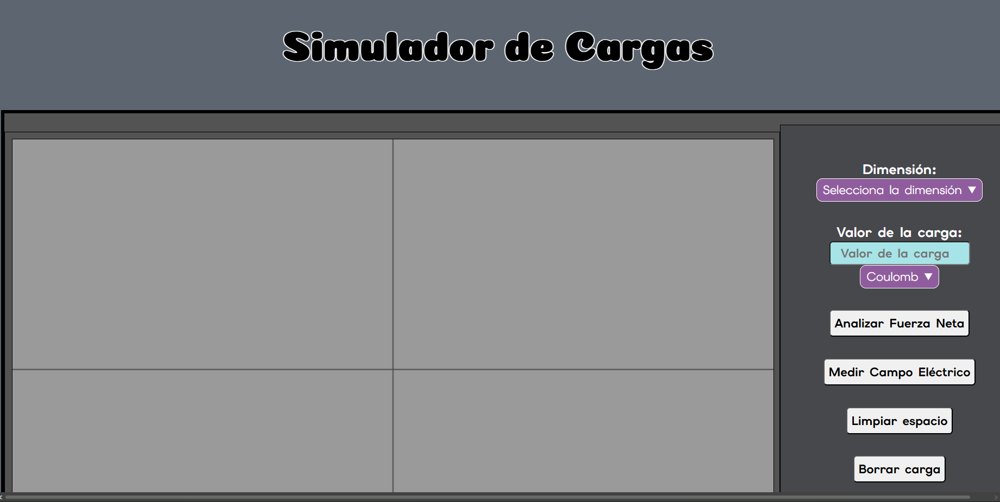
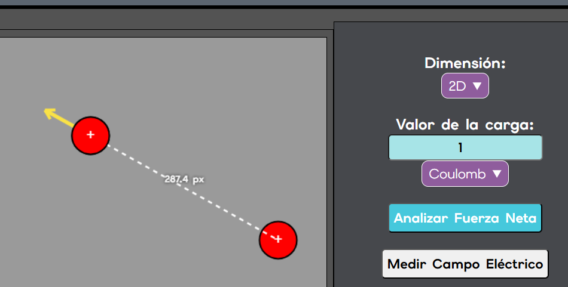
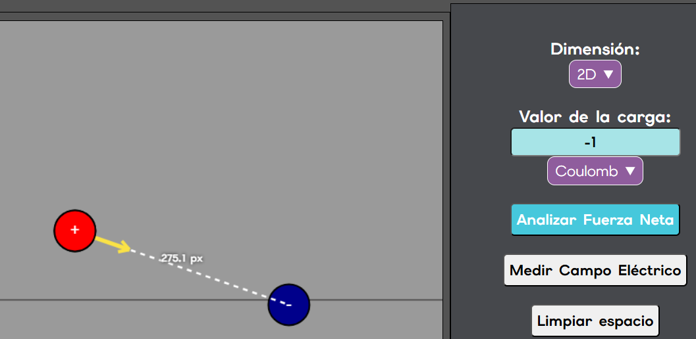
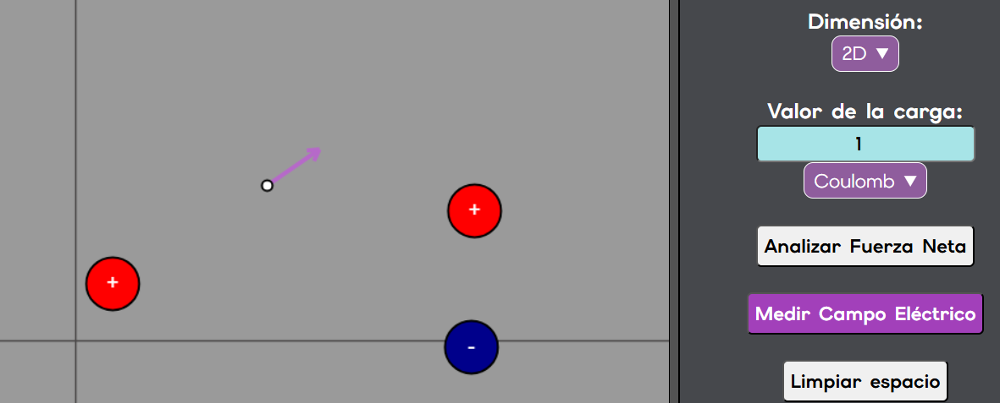
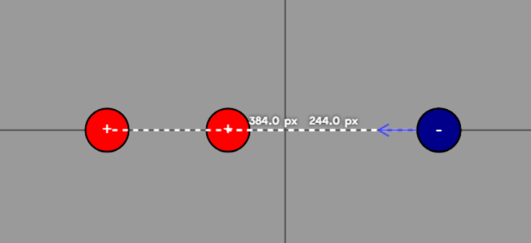
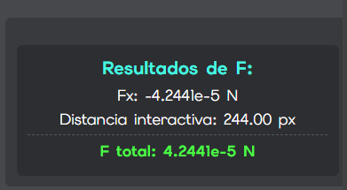
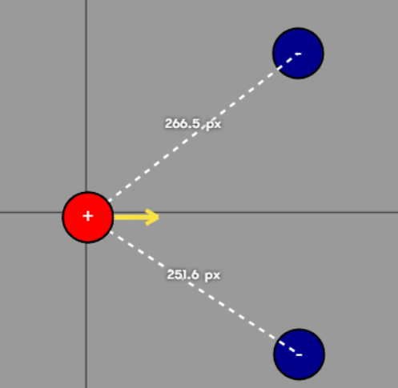
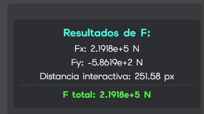
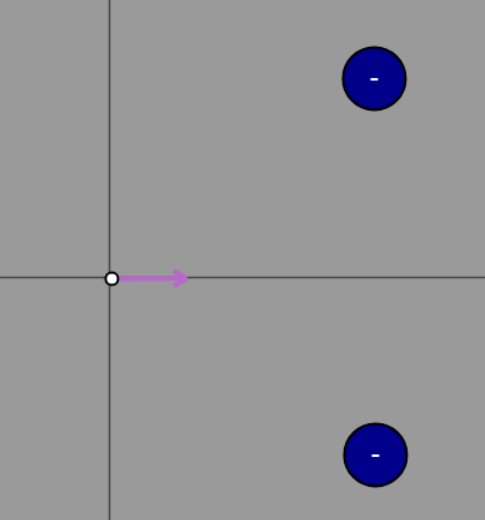
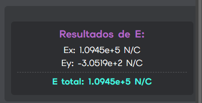

# Simulador de Cargas Eléctricas, Fuerza y Campo Eléctrico

## Integrantes :busts_in_silhouette: :

* Gutierrez Soto Alan Alberto :sunglasses:
* Favila Arellano Jacqueline Yuliana :smiley_cat:
* Rodríguez Yañez Santiago Gabriel :yum:

## Descripción del simulador:
El proyecto es un simulador interactivo para trabajar con cargas eléctricas, fuerza y campo eléctrico. Fue desarrollado con HTML, CSS y JavaScript con el uso del API Canvas API para poder dibujar en pantalla.

El simulador permite agregar varias cargas con distintas magnitudes, positivas o negativas, visualizarlas sobre un plano de trabajo y observar una representación de las fuerzas electroestáticas generadas sobre ellas-

Además, el simulador permite medir el campo eléctrico en un punto a partir de la interacción de las cargas.

Las cargas y el punto del campo eléctrico pueden ser borrados individualemente o todos juntos.

# Prueba el simulador Ahora :loudspeaker::exclamation: :alien:

Se puede acceder al simulador mediante el siguiente link:   :point_right: https://coyco12.github.io/Simulador-de-Cargas/ :point_left:

## Características

* Creación de cargas positivas y negativas
* Colocación de las cargas en la posición deseada con el uso del ratón
* Medición de una carga con el uso del ratón
* Medición de fuerza y campo a la vez
* Visualización de la dirección de la fuerza y el campo
* Notificaciones flotantes de problemas con el uso del simulador

# Instalación
**No requiere de instalación de dependencias.**

El repositorio puede ser clonado o descargado, la página es estática, de modo que puede ser ejecutado en la mayoría de exploradores tan solo abriendo index.html una vez ya descargado.

## Uso del simulador:
Al abrirlo será persentado con el título de la página, debajo del lado izquierdo se encuentra el área de trabajo y del lado derecho el panel de trabajo. El panel de trabajo está dividido en la configuración de la carga, botones de acción y cuadros de resultado, estos últimos solo aparecen una vez que se mide fuerza o campo

Para comenzar a trabajar en el área de trabajo, primero, desde el panel se debe **seleccionar una dimensión (1D o 2D)**, la cuál modificará cómo se pueden colocar las cargas.   Además se debe **elegir el valor que se le dará a la carga,** el valor se elige escribiendolo en el recuadro, usar un signo negativo antes de los números hace que la carga sea negativa. Debajo del recuadro para darle valor a la carga hay un cuadro de selección, con el que se puede elegir darle o no un prefijo al valor de la carga para hacerla más pequeña.

Una vez que la carga ya tiene dimensión y magnitud es posible colocarla sobre el área de trabajo, para **colocar una carga** solo es necesario **elegir su posición con el ratón y dar click sobre el área de trabajo**, se creará un círculo representando la carga, si la carga es positiva, el círculo será rojo con un signo "**+**" en su interior, si la carga es negativa, el círuclo será azúl y con un signo "**-**". Al crear la carga se mantienen los datos del panel, de modo que es posible crear múltimples cargas con el mismo valor rápidamente.    Si no se seleccionó una dimensión o si la carga no tiene valor o es 0, aparecerá una notificación flotante indicándolo. La notificación desaparece después de 3 segundos. No es posible colocar una carga dentro o muy creca de otra e intentarlo resultará en una notificación flotante avisándolo

Al presionar el botón **"Borrar carga"** se mantendrá activado al presionarlo, volverlo a presionar lo desactiva. Mientras esté activado, **al presionar sobre una carga, esta será eliminada.** El botón **"Limpiar espacio" sirve para borrar todas las cargas de la pantalla,** incluyendo la de prueba.  Cambiar de dimensión borra todas las cargas de la pantalla.

El botón **"Analizar Fuerza Neta"** se queda activado al presionarlo, se desactiva al presionarlo una vez más, mientras está activo, **al presionar cerca o sobre una carga se muestra la distancia de esta con respecto a las otras**, las distancias se marcan pixeles (px), **además muestra la fuerza total que las otras cargas generan sobre esta, representada por una flecha que apunta en dirección de la fuerza y en el cuadro de resultados muestra su magnitud.** Presionar el área de trabajo cuando no hay cargas mientras el botón está activo o no presionar ninguna carga mostrará una notificación de error.

El botón **"Medir Campo Eléctrico"** se queda activado al presionarlo, se desactiva al presionarlo una vez más. Mientras está activo, hacer click sobre el área de trabajo coloca un punto, diferenciable de las cargas por ser más pequeño, de color gris y sin texto, este punto es **la carga de prueba para medir el campo eléctrico,** al colocarlo **muestra la dirección del campo y en el cuadro de resultados su magnitud.** Presionar sobre el área de trabajo cuando no hay cargas mientras el botón está activo mostrará una notificación de error.

# Fundamento de lo que se muestra en pantalla
El simulador sustenta sus cálculos de fuerza eléctrica en la ley de coulomb para cargas:  
 F~E~ = k |q~1~q~2~| / r^2^ 
 
Y de la fórmula para el campo eléctrico: 
E = k q / r^2^

En la fórmula de fuerza eléctrica se usa el valor absoluto, para saber la dirección a la que apunta es necesario analizar, si la carga que se mide y la carga con que se compara son del mismo signo se repelen, si son de signo opuesto se atraen.

Para el campo eléctrico no sucede exactamente lo mismo, ya que la carga de prueba es siempre positiva, de modo que solo toma en cuenta el valor de la otra carga.

# Ejemplos de Uso y Capturas

### Ejemplo 1

Este ejemplo se realizó en 1 dimensión, se colocaron 2 cargas positivas de un lado, y a su derecha se colocó una carga negativa, sobre la cuál se analizó la fuerza. Se puede esperar que la fuerza se diriga hacia las cargas negativas, pues al ser de signo contrario, la carga es atraída a ellas. La magnitud de la fuerza es pequeña ya que las cargas positivas tenían un valor de 10 mili coulombs y la carga negativa de -20 mili coulombs.

   .

### Ejemplo 2

En este otro ejemplo, se realizó en 2 dimensiones, se colocaron 2 cargas negativas de 0.5 coulombs y una carga positva de 2 coulombs. Es importante recalcar que, al tener una colocación libre, es muy complicado crear un arreglo limpio, sin imperfecciones, por lo que no se consiguió una fuerza en y=0, pero aún así fue bastante cercano y se puede observar que la fuerza total no varió mucho

Después, se reutilizó el arreglo, eliminando la carga positiva y sustituyendola por una carga de prueba. El campo eléctrico, al solo depender de las demás cargas, nos dió la mitad de la fuerza calculada en la primera parte, ya que la fuerza se multiplicó por ddos por la magnitud de la carga positiva.

